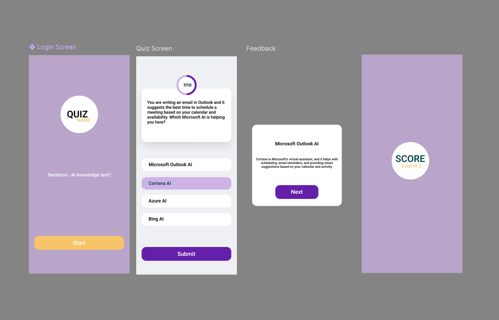

# SEAMLESS AI Quiz App



## Overview

SEAMLESS is an interactive quiz game designed to educate users about AI tools and their real-life applications. The game presents daily activity-based questions and provides insights into how AI enhances various aspects of life. 

## Features
- Engaging quiz format with multiple-choice questions
- Instant feedback and AI-related explanations for each question
- Score tracking and summary at the end of the quiz
- Responsive UI built with React and React Router

## Technologies Used
- **Frontend**: React.js
- **Routing**: React Router
- **Styling**: SCSS
- **State Management**: React Hooks

## Installation
1. Clone the repository:
```
    git clone https://github.com/Magret1730/omnicoders-ip-client.git
    cd omnicoders-ip-client
```

2. Install dependencies
``` npm install ```

3. Set up environment variables
- Rename `.env.sample` to `.env`  
- Update the required variables based on the backend API configuration  

4. Set up the backend
- Follow the [Backend Setup Guide](https://github.com/AnushaDunaboyina/omnicoders-ip-api) 

5. Start the development server `npm run dev`

## How to Use

1. **Start at the home page** and read the introduction  
   Learn about AI's role in daily life before beginning

2. **Click "Start" to begin the quiz**  
   Launch the interactive quiz experience

3. **Answer all multiple-choice questions**  
   Test your knowledge of AI applications

4. **View your personalized results and feedback**  
   Get a score summary with customized performance evaluation

5. **Return home to retake the quiz if desired**  
   Option to restart and improve your score

## Future Enhancements

- **Expand quiz categories**  
  Add more AI-related topics beyond daily life applications

- **User account system**  
  Implement progress tracking and personal score history

- **Difficulty levels**  
  Add beginner/intermediate/advanced question sets

- **Multimedia integration**  
  Incorporate images and videos to enhance learning experience

- **Performance analytics**  
  Add detailed breakdown of question performance

- **Mobile optimization**  
  Enhance mobile experience with dedicated UI improvements
